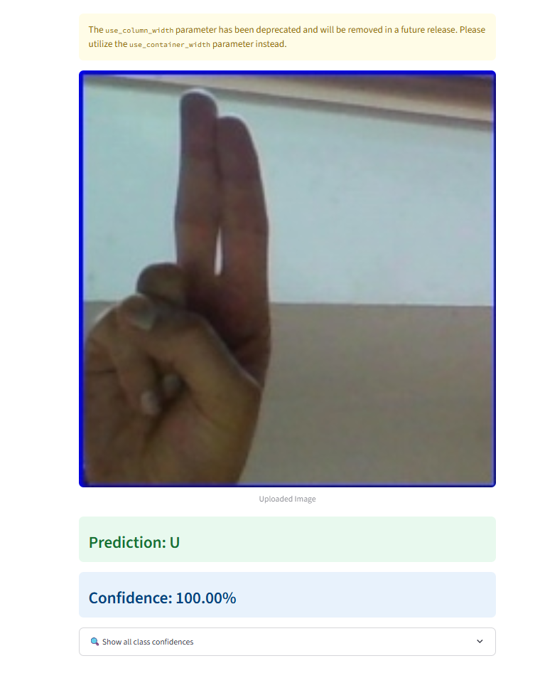

# 🤟 Sign Language Predictor

Automatically recognize sign language gestures from live video or images using deep learning.

---

## Table of Contents
1. [About the Project](#about-the-project)  
2. [Features](#features)  
3. [Demo 📸](#demo-📸)  
4. [Technology Stack](#technology-stack)  
5. [Installation & Setup](#installation--setup)   
6. [Model Training](#model_train)  
7. [License](#license)  

---

## About the Project

Sign Language Predictor uses a Convolutional Neural Network (CNN) model to classify hand gestures representing sign language alphabets (A–Z). It works with real-time webcam input or static images, showing predictions with confidence scores.

---

## Features

- ✅ Real-time gesture detection using webcam  
- 🖼️ Image file support for offline testing  
- 🎯 Recognition accuracy up to 99.95% (when using the pretrained model)  
- 📊 Overlaid confidence scores for each prediction

---

## Demo 📸

Here’s an example of the predictor in action:

---

## Technology Stack

- **Language**: Python 3.9  
- **Libraries**: OpenCV, TensorFlow/Keras, NumPy  
- **Model**: Custom CNN trained on publicly available ASL dataset  
- **Input**: Webcam feed or image files  
- **Output**: Detected sign letter with confidence overlay

---

## Installation & Setup

### Prerequisites
- Python 3.7+  
- `pip` for dependency management

